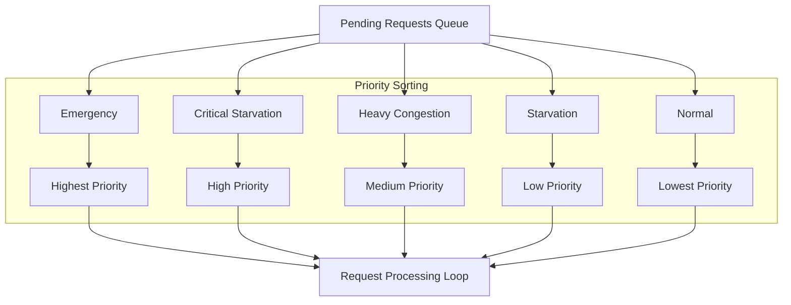
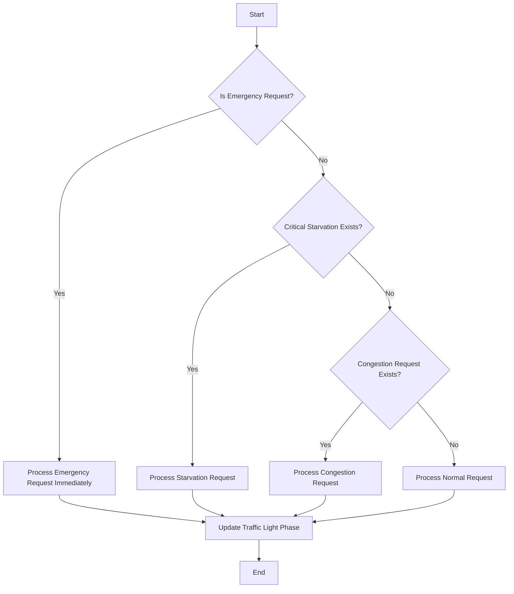
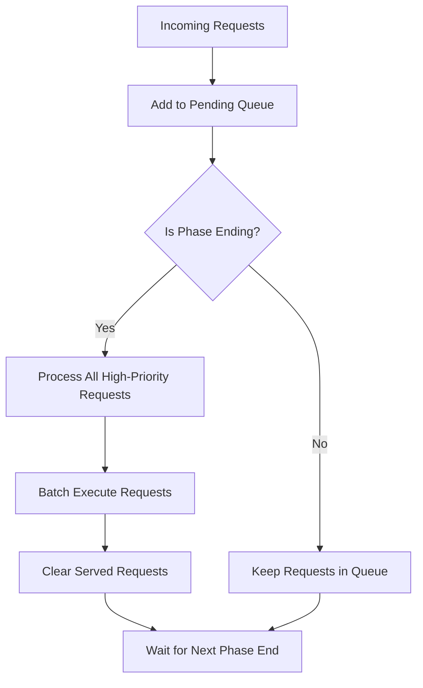
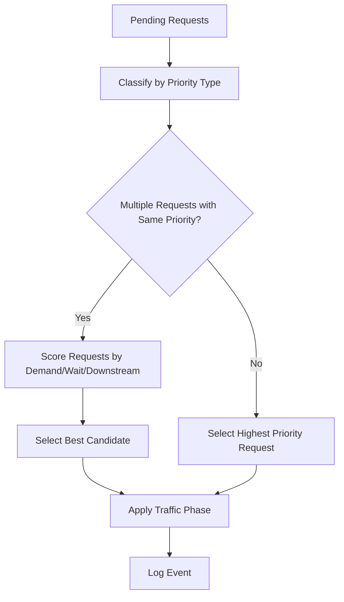

```mermaid
%% Diagram 1: Sơ đồ cấu trúc hàng đợi yêu cầu phân cấp với các type priority và flow xử lý
graph TD
    A[Pending Requests Queue] --> B1[Emergency]
    A --> B2[Critical Starvation]
    A --> B3[Heavy Congestion]
    A --> B4[Starvation]
    A --> B5[Normal]
    subgraph Priority Sorting
        B1 --> C1[Highest Priority]
        B2 --> C2[High Priority]
        B3 --> C3[Medium Priority]
        B4 --> C4[Low Priority]
        B5 --> C5[Lowest Priority]
    end
    C1 & C2 & C3 & C4 & C5 --> D[Request Processing Loop]
```

```mermaid
%% Diagram 2: Quy trình xử lý yêu cầu theo mức độ ưu tiên, từ kiểm tra emergency đến chuyển pha
flowchart TD
    S[Start] --> E{Is Emergency Request?}
    E -- Yes --> F[Process Emergency Request Immediately]
    E -- No --> G{Critical Starvation Exists?}
    G -- Yes --> H[Process Starvation Request]
    G -- No --> I{Congestion Request Exists?}
    I -- Yes --> J[Process Congestion Request]
    I -- No --> K[Process Normal Request]
    F & H & J & K --> L[Update Traffic Light Phase]
    L --> END[End]
```

```mermaid
%% Diagram 3: Sơ đồ stacked requests và batch processing trong hàng đợi APC
flowchart TD
    A[Incoming Requests] --> B[Add to Pending Queue]
    B --> C{Is Phase Ending?}
    C -- Yes --> D[Process All High-Priority Requests]
    D --> E[Batch Execute Requests]
    E --> F[Clear Served Requests]
    C -- No --> G[Keep Requests in Queue]
    F & G --> H[Wait for Next Phase End]
```

```mermaid
%% Diagram 4: Quy trình giải quyết xung đột giữa các yêu cầu, từ classification đến conflict resolution
flowchart TD
    A[Pending Requests] --> B[Classify by Priority Type]
    B --> C{Multiple Requests with Same Priority?}
    C -- Yes --> D[Score Requests by Demand/Wait/Downstream]
    D --> E[Select Best Candidate]
    C -- No --> F[Select Highest Priority Request]
    E & F --> G[Apply Traffic Phase]
    G --> H[Log Event]
```